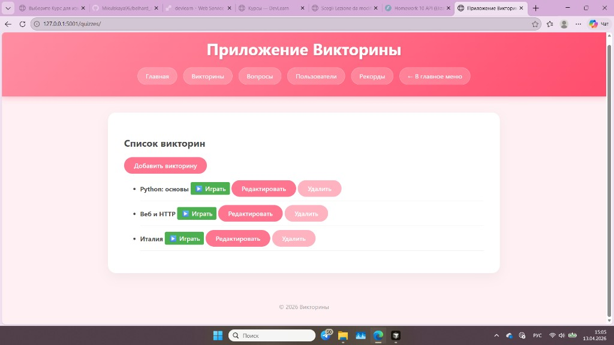
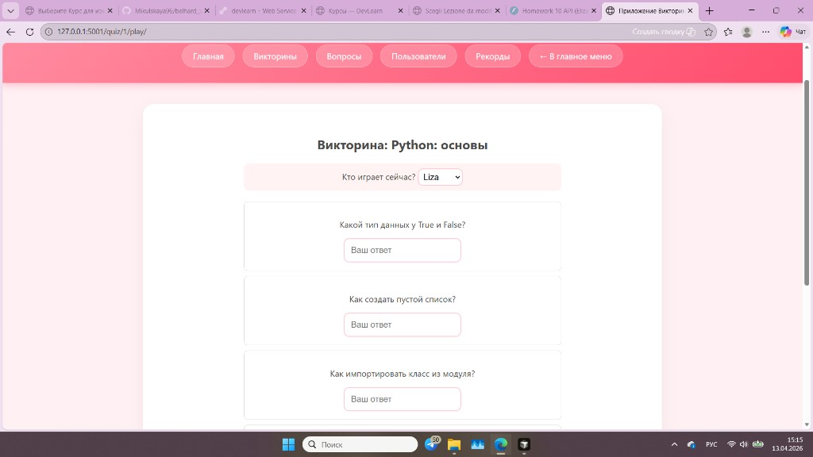
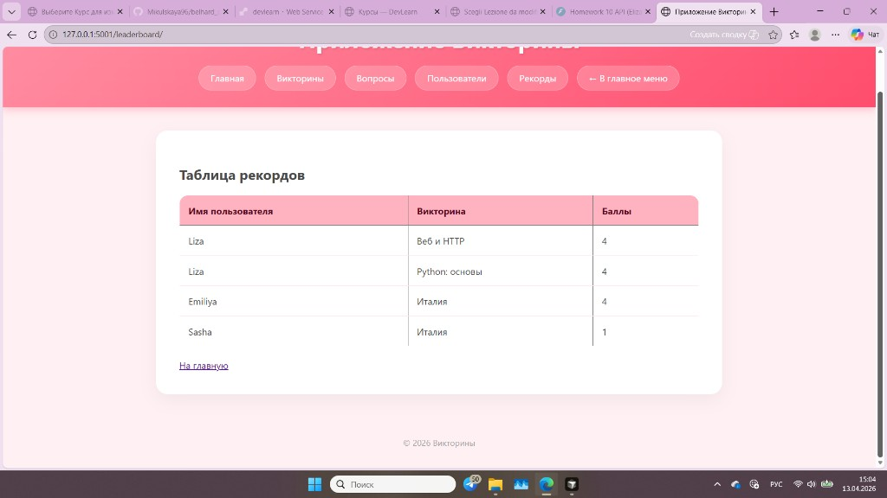
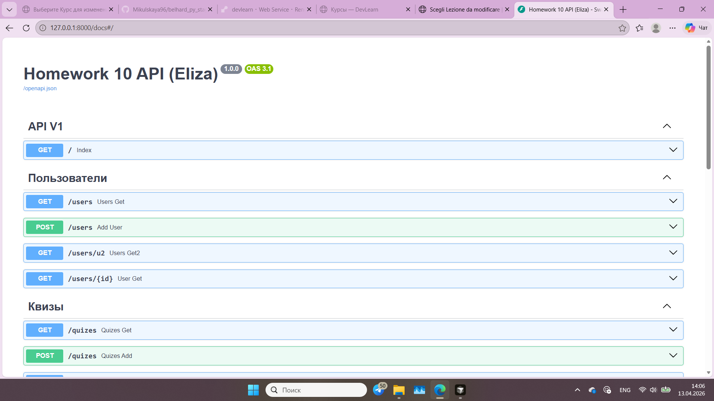
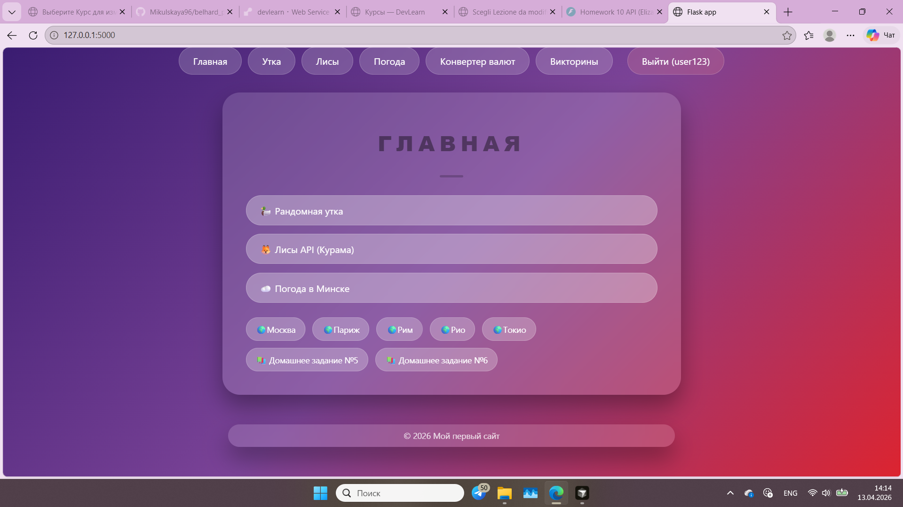

# belhard_py_stage2

[](LICENSE)
[](https://www.python.org/)
[](https://github.com/Mikulskaya96/belhard_py_stage2/actions/workflows/ci.yml)

Student coursework (**Belhard / Python stage 2**): small **Flask** apps (Jinja2, external APIs, sessions), a **quiz** project with **Flask + SQLAlchemy + Flask-Migrate**, and a **FastAPI** REST API.

---

## Contents

- [Features](#features)
- [Tech stack](#tech-stack)
- [Screenshots](#screenshots)
- [Quick start](#quick-start)
- [Run individual modules](#run-individual-modules)
- [Environment variables](#environment-variables)
- [Repository layout](#repository-layout)
- [GitHub: About & topics](#github-about--topics)
- [License](#license)

---

## Features

| Area | What it covers |
|------|----------------|
| **Networking** | TCP client/server (`homework1`, `homework2`) |
| **Flask basics** | Routes, templates, Random Duck/Fox APIs, OpenWeather (`homework3`) |
| **Flask + auth & extras** | Registration/login (session), currency converter (`homework4`) |
| **Flask + DB** | Users, quizzes, questions, play flow, leaderboard (`homework8`) |
| **REST API** | Async SQLAlchemy, Pydantic, routers (`homework10`) |

UI strings are mostly **Russian** (course language); this README is **English** for recruiters and GitHub.

---

## Tech stack

| Layer | Technologies |
|-------|----------------|
| Web | Flask, Jinja2, FastAPI, Starlette, uvicorn |
| Data | SQLAlchemy, Flask-SQLAlchemy, Alembic / Flask-Migrate, Pydantic, aiosqlite |
| HTTP | requests |
| Config | python-dotenv |

---

## Screenshots

PNG files live in [`docs/screenshots/`](docs/screenshots/). **What to capture and exact filenames** (so README links work): see [`docs/screenshots/README.md`](docs/screenshots/README.md) (RU) or the table below.

| File (put in `docs/screenshots/`) | What to show |
|-----------------------------------|--------------|
| `quiz-home.png` | **homework8** — quiz list (`/quizzes/`) or main entry (navigation, “Играть”). |
| `quiz-play.png` | **homework8** — playing a quiz (questions on screen). |
| `quiz-leaderboard.png` | **homework8** — leaderboard / results. |
| `fastapi-docs.png` | **homework10** — Swagger UI at `/docs`. |
| `flask-main.png` | **homework4** — main page after login (optional, shows auth + UI). |

**How to capture (Windows):** `Win + Shift + S` (Snipping Tool), save as PNG. **How to capture (macOS):** `Cmd + Shift + 4`.

### Quiz app (Flask + SQLAlchemy)







### FastAPI (OpenAPI)



### Flask demos (optional)



---

## Quick start

**Windows (PowerShell)**

```bash
python -m venv .venv
.\.venv\Scripts\activate
pip install -r requirements.txt
```

**Linux / macOS**

```bash
python3 -m venv .venv
source .venv/bin/activate
pip install -r requirements.txt
```

---

## Run individual modules

| Module | Command (from repo root, venv active) | URL / note |
|--------|----------------------------------------|------------|
| **Quiz app** | `cd homework8` → `python app.py` | <http://127.0.0.1:5001/> |
| **Flask demos** | `cd homework3` or `cd homework4` → `python app.py` / `python main.py` | default Flask port **5000** |
| **FastAPI** | `cd homework10` → `python main.py` | <http://127.0.0.1:8000/docs> |

For weather-related routes in **homework3** / **homework4**, set `OPENWEATHER_API_KEY` (see below).

---

## Environment variables

| Variable | Required for | Notes |
|----------|----------------|-------|
| `OPENWEATHER_API_KEY` | Weather in homework3, homework4 | [OpenWeather API](https://openweathermap.org/api) |
| `SECRET_KEY` | Signed cookies in homework4 | Optional locally; use a strong value in production |

Copy `.env.example` to `.env` at the **repository root**. `homework3` and `homework4` load it via `python-dotenv`. The `.env` file is **not** committed.

---

## Repository layout

```
belhard_py_stage2/
├── .github/workflows/   # CI (install deps + syntax check)
├── docs/screenshots/    # Optional UI screenshots for README
├── homework1/ … homework10/   # Course assignments
├── requirements.txt
├── README.md
├── .env.example
└── LICENSE
```

---

## GitHub: About & topics

To make the repo page look complete (like a polished portfolio project), set the **About** section on GitHub:

1. **Description** (example):

   `Python coursework — Flask (Jinja2, APIs, sessions), quiz app with SQLAlchemy + migrations, FastAPI REST API.`

2. **Website** — leave empty or add a link if you deploy later (e.g. Render).

3. **Topics** (suggested tags):

   `python`, `flask`, `fastapi`, `sqlalchemy`, `pydantic`, `jinja2`, `rest-api`, `sqlite`, `python-dotenv`, `education`

4. Enable **Releases** only if you use them; **Issues** optional.

---

## License

This project is licensed under the [MIT License](LICENSE).

---

## Кратко по-русски

Учебный репозиторий: Flask (шаблоны, внешние API, сессии), квизы на Flask + SQLAlchemy + миграции, отдельно API на FastAPI. Запуск и переменные окружения — см. таблицы выше. Скопируйте `.env.example` в `.env` в корне репозитория.
